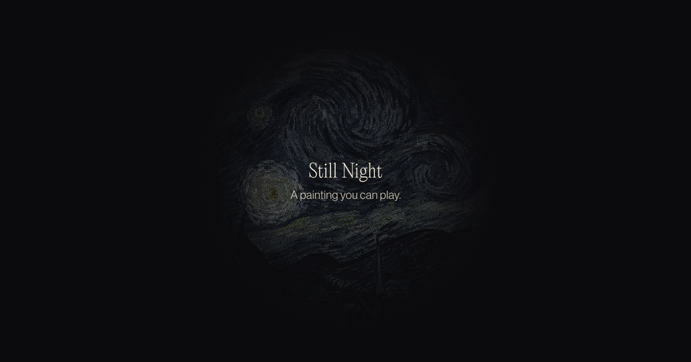

# Still Night



**A painting you can play.** Still Night turns Van Gogh's Starry Night into a
playable instrument. Brighter colors play higher notes.

**Live:** https://stillnight.joshua-garcia.com

## The idea

This isn’t music played over a painting. The painting is the instrument.

Brightness shapes how we hear pitch the same way it shapes how we see color.
Still Night reads the painting’s own light and dark and lets it decide what it
sounds like. The dark parts answer low. The bright parts ring high.

## How it works

**The painting becomes points.** The source image is dithered with
Floyd-Steinberg error diffusion, then the surviving pixels become a point cloud,
weighted so edges keep their density and flat sky thins first. Roughly 130,000
points at full quality, placed at canvas resolution so they stay pixel-aligned
on any display.

**The painting is divided into five regions.** A hand-authored territory map
assigns every pixel to the cypress, the village, the sky, the horizon or the
stars. Each region is a voice. Together they spell a Gm7 chord across three
octaves:

| Region | Notes |
| --- | --- |
| Cypress | G2, Bb2 |
| Village | D3, F3 |
| Sky | G3, Bb3, D4 |
| Horizon | D4, F4 |
| Stars | G4, D5 |

**The brushstrokes drive the motion.** A flow field derived from the painting
encodes the direction and coherence of the strokes. Particles follow it, so the
movement traces how Van Gogh laid the paint down instead of drifting through
noise.

**Holding shapes the sound.** Each voice evolves while you hold it: the filter
opens, harmonics come in, a detuned layer fades up, reverb expands. Let go and it
settles into a loop whose complexity reflects how long you held. Tone.js drives
the synthesis, with seven custom AudioWorklet processors, an FDN reverb and a
freeze-to-buffer tap.

**The heavy work happens ahead of time.** Segmentation, distance fields and flow
curvature are computed offline and shipped as a Brotli-compressed binary in a
small custom format (`.dvs`). That saves about 700 ms of startup. If it fails to
load, the runtime computes everything live instead.

## Built with

Vanilla JavaScript and WebGL 2. No framework, no bundler, no build step for the
site itself, and no runtime dependencies except Tone.js from a CDN.

- **WebGL 2** for point-cloud rendering and GPU particle simulation
- **Web Audio API** and **Tone.js** for synthesis, with custom AudioWorklets
- **Web Workers** for the distance-field computation during load
- **Netlify** for hosting, with an edge function that filters scraper traffic

## Running locally

```
npm install
npm run serve
```

Open http://localhost:8080.

Useful URL parameters: `?debug` for verbose logging, `?perfOverlay` for a live
performance profiler, `?diagnose` for a GPU diagnostic, and `?quality=low` or
`?dpr=0.75` to force a lower rendering tier.

## Rebuilding pre-baked assets

The production site ships pre-compressed point-cloud payloads in
`assets/*.dvs.br`. To regenerate them from the source image:

```
npm run prebake
```

## More

There's a longer write-up of the research and the design decisions behind it at
[joshua-garcia.com/still-night](https://www.joshua-garcia.com/still-night).

## License

© 2026 Joshua Garcia. All rights reserved.
